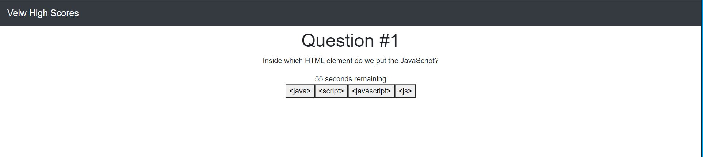
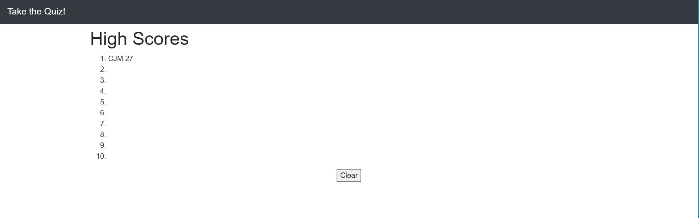

# CodingQuiz

For this project, I was tasked with creating a coding quiz with a high score function.

The code is meant to run the following:
1. When start button is clicked, the quiz begins and prompts user with first question and simultaneously starting the timer.
2. User is 4 answer options, clicking one will move onto the next question and show if the user was correct or incorrect.
3. If the user answers incorrectly, the timer is deducted by 10 secs
4. Once all 5 questions have been answered, the timer stops and the user is taken to the highscore screen
5. User then enters their initials, which is saved in local storage and populated into the High Score screen. 
6. User may access high score screen to see their score and clear the Local Storage if they wish.

